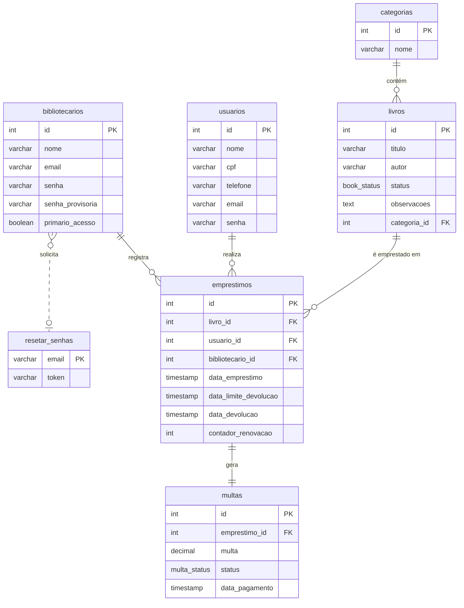

# Biblioteca Municipal

> API RESTful para o sistema de gerenciamento da Biblioteca Municipal Ney Pontes de Mossoró/RN.

Este projeto é a solução para o Desafio Nº 0003/2025 da seleção de estágio para a Prefeitura de Mossoró. O objetivo é desenvolver um sistema para modernizar a gestão da Biblioteca Municipal Ney Pontes, substituindo os processos manuais de catalogação e empréstimo de livros.

Nesse desafio, foi desenvolvida uma API em Ruby on Rails para controlar o acervo, os usuários e os empréstimos de livros. Essa API foi projetada para ser consumida por uma aplicação front-end em React com Tailwind CSS.

# Funcionalidades

## Funcionalidades Principais

* Autenticação de Bibliotecários:

    * Cadastro de novos bibliotecários com nome, e-mail e senha criptografada.

    * Login seguro para acesso ao sistema.

    * Funcionalidade de recuperação de senha por e-mail.

    * Sistema de senha provisória para o primeiro acesso, garantindo maior segurança.

* Gestão de Livros e Categorias:

    * CRUD completo para livros, com campos para título, autor, categoria e status (disponível/emprestado).

    * CRUD para as categorias dos livros.

* Gestão de Usuários da Biblioteca:

    * Cadastro de usuários com nome completo, CPF, telefone e e-mail.

    * Geração automática de uma "senha de empréstimo" para cada usuário, enviada por e-mail.

* Sistema de Empréstimos:

    * Fluxo completo para registrar o empréstimo de um livro, validando o status do livro e a senha do usuário.

    * Registro da data de empréstimo e cálculo automático da data de devolução para 15 dias úteis.

## Funcionalidades Extras (Bônus)

* Relatório de livros em atraso.

* Renovação online de empréstimos.

* Histórico de empréstimos por usuário.

* Cálculo de multas para devoluções em atraso.

# Tecnologias Utilizadas

* Backend (API): Ruby on Rails 

* Frontend: React, Tailwind CSS

* Banco de Dados: PostgreSQL

# Instalação e Execução

Para executar este projeto localmente, siga os passos abaixo.

## Pré-requisitos

* Ruby (~> 3.x)

* Rails (~> 7.x)

* Node.js (~> 18.x)

* Yarn ou NPM

* PostgreSQL

## Backend (API Rails)

* Clone o repositório: git clone https://github.com/edu-doc/BibliotecaMunicipal.git

* Instale as dependências (gems): bundle install

* Configure o banco de dados e edite o arquivo .env com as credenciais do seu banco de dados PostgreSQL.

* Crie, migre e popule o banco de dados: rails db:create db:migrate db:seed

* Inicie o servidor Rails: rails server

## Frontend (React)

* Navegue até o diretório do frontend (Pasta raiz)

* Instale as dependências: npm install ou yarn install

* Inicie a aplicação React: npm start ou yarn start

* A aplicação estará acessível em http://localhost:3001 (ou outra porta disponível).

# Diagrama do Banco de Dados

# Contribuindo

Se você gostaria de contribuir, por favor, faça um fork do repositório e use um feature branch. Pull Requests são muito bem-vindos! Para grandes mudanças, por favor, abra uma issue primeiro para discutir o que você gostaria de mudar.

# Links

* Repositório: https://github.com/edu-doc/BibliotecaMunicipal

* Reportar um problema: https://github.com/edu-doc/BibliotecaMunicipal/issues
